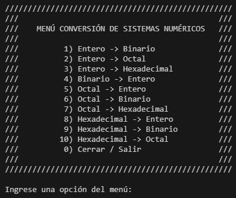

# Sistema de Conversiones Numéricos

  

  

<!--  
--- -->

## Descripción

PROGRAMACIÓN IMPERATIVA: El programa de conversión de sistemas numéricos permite al usuario realizar operaciones de conversión entre diferentes sistemas numéricos. Al ejecutar el programa, esta muestra un menú  de opciones donde el usuario puede seleccionar si desea convertir de decimal a otro sistema, o bien  de binario o hexadecimal a decimal. Dependiendo de la opción elegida, el programa solicitará al usuario que ingrese el número a convertir y el sistema de origen o destino, para luego mostrar el resultado de la conversión.

### Funciones disponibles

- Conversión de entero –> (binario; octal; hexadecimal)
- Conversión de binario –> (entero)   
- Conversión de octal –> (entero; binario; hexadecimal) 
- Conversión de hexadecimal –> (entero; binario; octal) 

#### Próximamente mas metodos de conversion y funciones propias para cada uno

### Algunas fuentes de consulta

[Convertir Sistemas de Numeración](https://www.mathepower.com/es/sistemas_de_numeracion.php)

[Conversión entre sistemas](https://www.aulafacil.com/cursos/hardware/arquitectura-de-computadores/conversion-entre-sistemas-l33098#:~:text=Para%20convertir%20desde%20el%20sistema,entera%20se%20anota%20el%20residuo)
