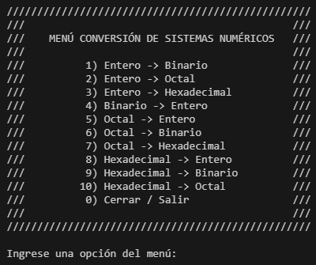

# Sistema de Conversiones Numéricos

  

<!--  
--- -->

## Descripción

PROGRAMACIÓN IMPERATIVA: El programa de conversión de sistemas numéricos permite al usuario realizar operaciones de conversión entre diferentes sistemas numéricos. Al ejecutar el programa, esta muestra un menú  de opciones donde el usuario puede seleccionar si desea convertir de decimal a otro sistema, o bien  de binario o hexadecimal a decimal. Dependiendo de la opción elegida, el programa solicitará al usuario que ingrese el número a convertir y el sistema de origen o destino, para luego mostrar el resultado de la conversión.

<!-- ### 
***         MENÚ CONVERSIÓN DE SISTEMAS NUMÉRICOS *** 
1. Conversión binario – decimal 
2. Conversión decimal – binario 
3. Conversión decimal – octal 
4. Conversión octal – decimal 
5. Conversión decimal – hexadecimal 
6. Conversión hexadecimal – decimal 
7. Conversión octal – hexadecimal 
8. Conversión hexadecimal – octal 
9. Conversión hexadecimal – binario 
10. Conversión octal -binario 
11. Salida
 -->

### Algunas fuentes de consulta

[Convertir Sistemas de Numeración](https://www.mathepower.com/es/sistemas_de_numeracion.php)
[Conversión entre sistemas](https://www.aulafacil.com/cursos/hardware/arquitectura-de-computadores/conversion-entre-sistemas-l33098#:~:text=Para%20convertir%20desde%20el%20sistema,entera%20se%20anota%20el%20residuo)
